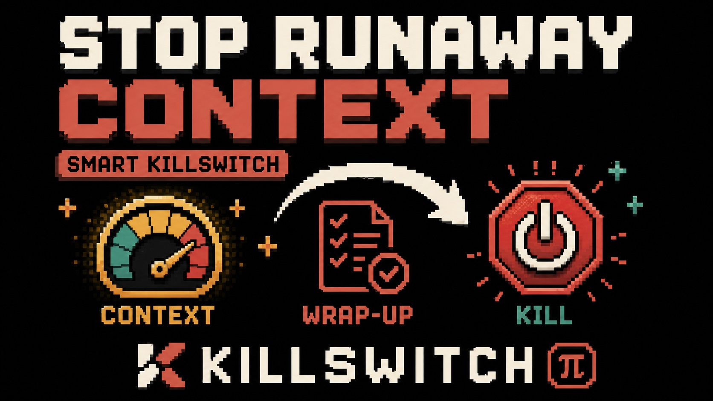

# ☠️ Killswitch

Killswitch keeps Pi runs controlled by enforcing context-budget wrap-up and kill thresholds.

Start working. Stop before the context gets out of hand.

<p align="center">
  
</p>

## What it does

`pi-killswitch` watches Pi's current context usage and can request a wrap-up or kill the current run when configured thresholds are reached.

It can:

- send a wrap-up steering message near the context budget
- abort the current run at the kill threshold
- auto-disable after a kill until the next safe rearm
- persist per-session state across reloads

## What it does not do

`pi-killswitch` does not switch models, manage subagents, manage compaction, or route between premium and economy models.

## Package contract

`pi-killswitch` is a Pi package, not a generic Node library. Pi loads the TypeScript extension entry directly, and the package does not define Node library entry points.

## Install

```bash
pi install pi-killswitch
```

Open the config UI:

```text
/killswitch
```

If no config file exists, Killswitch uses safe defaults. To disable it globally, set `enabled` to `false` in `/killswitch`, or use `/killswitch off` to disable only the current session.

## Commands

```text
/killswitch
/killswitch status
/killswitch wrap
/wrap-up
/killswitch on
/killswitch off
/killswitch help
```

- `/killswitch` opens the config UI.
- `/killswitch status` shows current usage, active threshold, thresholds, mode, state, config path, and version.
- `/killswitch wrap` requests an immediate wrap-up.
- `/wrap-up` is a shortcut for requesting an immediate wrap-up.
- `/killswitch on` enables Killswitch for the current session.
- `/killswitch off` disables Killswitch for the current session.
- `/killswitch help` shows command help.

## Config

Config is stored in your Pi agent directory as `killswitch.json`.

Fields:

- `enabled`: enable or disable globally
- `mode`: `kill`, `wrap-up`, or `wrap-up-then-kill`
- `autoDisarmAfterKill`: auto-disable after a kill before the next prompt
- `autoRearmWhenSafe`: auto-rearm when usage falls back below the relevant threshold
- `wrapUpThreshold`: threshold for wrap-up, required unless mode is `kill`
- `killThreshold`: threshold for kill
- `wrapUpMessage`: wrap-up message

Thresholds are explicit and use exactly one metric:

```json
{ "metric": "percent", "value": 75 }
```

or:

```json
{ "metric": "tokens", "value": 100000 }
```

In `wrap-up-then-kill` mode, the wrap-up and kill thresholds must use the same metric, and wrap-up must be lower than kill.

Invalid or unreadable config produces a visible error and falls back to safe defaults.

## Wrap-up vs kill

A wrap-up sends a user steering message asking the agent to finish gracefully, summarize current state, avoid more tools, and stop.

A kill aborts the current agent run immediately, marks the session as killed, then auto-disables before the next prompt. It re-arms automatically when context falls back below the kill threshold.

In `wrap-up-then-kill` mode, Killswitch requests wrap-up when the wrap threshold is reached. If the kill threshold is already reached in the same context event, it kills immediately rather than waiting for another event.

## Recommended defaults

The default mode is `wrap-up-then-kill`:

```json
{
  "enabled": true,
  "mode": "wrap-up-then-kill",
  "autoDisarmAfterKill": true,
  "autoRearmWhenSafe": true,
  "wrapUpThreshold": { "metric": "percent", "value": 75 },
  "killThreshold": { "metric": "percent", "value": 85 },
  "wrapUpMessage": "Context budget reached. Finish gracefully, summarize current state, do not call more tools, and stop."
}
```

## Relationship to pi-downshift

[`pi-downshift`](https://github.com/boadij/pi-downshift) switches to a cheaper model after a context threshold.

[`pi-killswitch`](https://github.com/boadij/pi-killswitch) wraps up or kills the run after a context threshold.

They solve related but different problems.

## Release

Local checks before publishing:

```bash
npm ci
npm run check
npm pack --dry-run
```

Release Please is configured for `pi-killswitch` and npm provenance publishing. See [RELEASING.md](./RELEASING.md).
